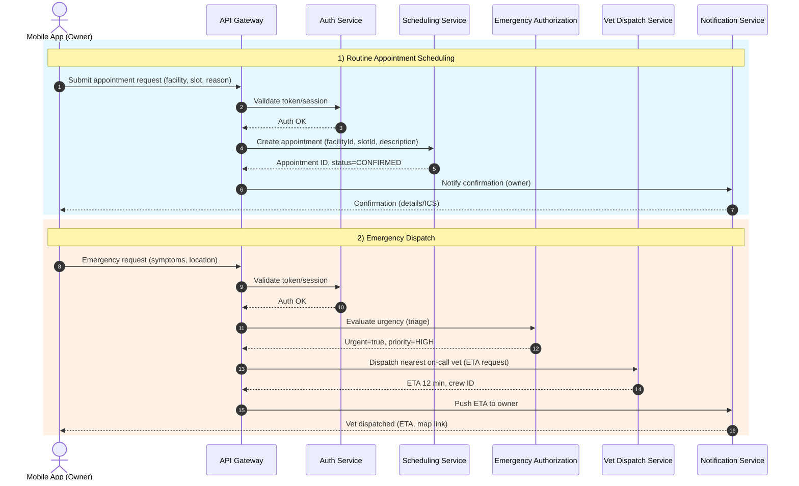

# Appointment Scheduling & Emergency Dispatch

This sequence diagram models two related workflows: routine appointment scheduling and urgent emergency dispatch. It highlights the sequential runtime behavior across the mobile app, API gateway, auth, scheduling, dispatch, and notification components.

## Mermaid Sequence Diagram

## Purpose
- Model both routine and urgent appointment workflows, highlighting sequential runtime behavior.
- Clarify separation of concerns: gateway, authN, scheduling, emergency triage, dispatch, and notifications.

## Notes
- In the current prototype:
  - Routine appointments are created with `appointments` and `facility_slots` tables; the GUI flow prompts for a slot and reason.
  - Emergency dispatch is simulated in the CLI (e.g., `EmergencyDispatchService`) and can be surfaced via UI later.
- Production guidance:
  - API gateway can be an ingress + reverse proxy; auth via JWT.
  - Notifications may send push + email + ICS calendar files.
  - Dispatch integrates with mapping/traffic for accurate ETA.
